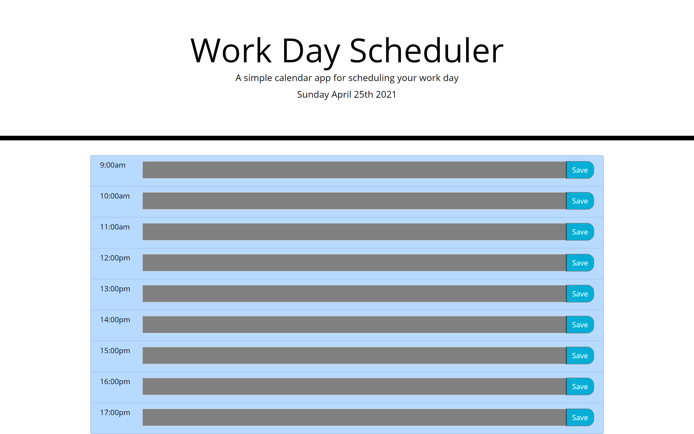

## Day Planner

---

---

## Acceptance Criteria for Day Planner

```
GIVEN I am using a daily planner to create a schedule
WHEN I open the planner
THEN the current day is displayed at the top of the calendar
WHEN I scroll down
THEN I am presented with timeblocks for standard business hours
WHEN I view the timeblocks for that day
THEN each timeblock is color coded to indicate whether it is in the past, present, or future
WHEN I click into a timeblock
THEN I can enter an event
WHEN I click the save button for that timeblock
THEN the text for that event is saved in local storage
WHEN I refresh the page
THEN the saved events persist
```

#### JS

     [x] Created array of objects for workshift 9am - 17pm
     [x] getToday() function uses moment function to get todays date and time
     [x] getTasks() function Once we load page we get our saved information from local storage
     [x] renderTasks() function rendering tasks to each input when we load the page
     [x] setTasks() saves tasks to local storage
     [x] Added button click event listener for saving tasks
     [x] checkIfPassed() function checks and compares current time with values in our object
     [x] If time is passed it colors inputs gray
     [x] If time is Current it colors input red
     [x] If time is in future it colors inputs green

---


